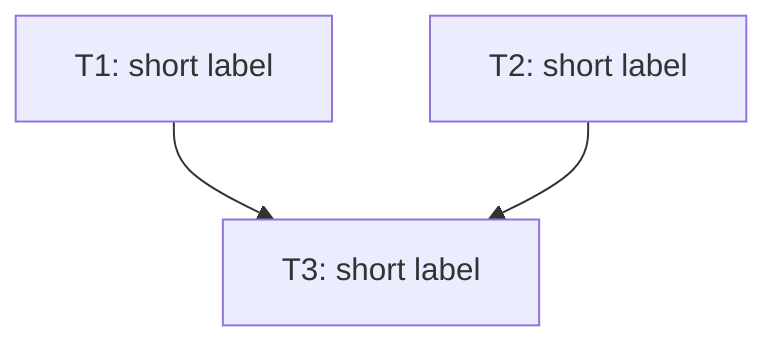

# Bullet {{NN}} — {{Name}}

**Goal:** {{what this bullet demonstrates end-to-end once complete}}

**Serves these PRD items:**

- US-{{n}}: "{{quoted user story}}"
- G-{{n}}: "{{quoted measurable goal}}"

## Tasks

Each line: `**{{id}}** [AFK|HIL] {{description}} — serves: {{PRD refs}} — depends: {{task ids, or —}}`

- [ ] **T1** [AFK] {{description}} — serves: US-1 — depends: —
- [ ] **T2** [AFK] {{description}} — serves: G-1 — depends: —
- [ ] **T3** [HIL] {{description}} — serves: US-1 — depends: T1, T2

## Dependency tree

Tasks at the same depth with no edge between them run in parallel.

## Human-in-the-loop callouts

- **T3** — {{the specific decision or action the human must make, and which HIL criterion makes it irreducible (judgment / credential / blocked-on-info / high-risk approval)}}

## Done when

{{the observable, demoable outcome that means this bullet is complete}}
